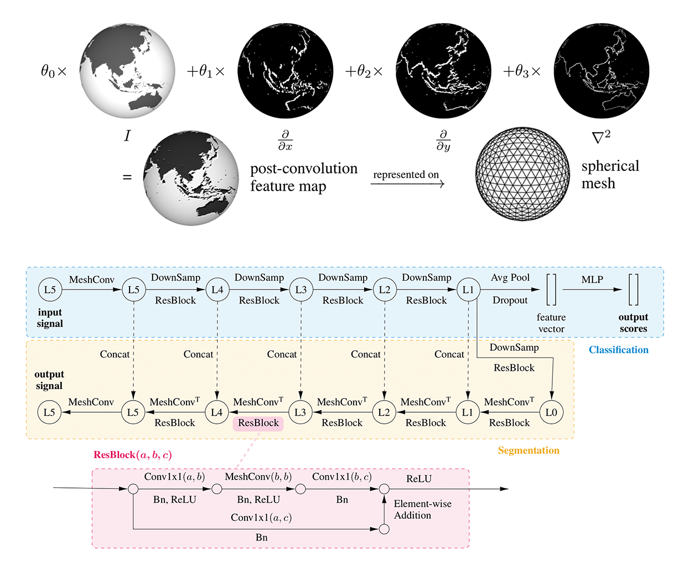

## UGSCNN: Spherical CNNs on Unstructured Grids
 
By: [Chiyu "Max" Jiang](http://maxjiang.ml/), [Jingwei Huang](http://stanford.edu/~jingweih/), [Karthik Kashinath](http://www.nersc.gov/about/nersc-staff/data-analytics-services/karthik-kashinath/), [Prabhat](http://www.nersc.gov/about/nersc-staff/data-analytics-services/prabhat/), [Philip Marcus](http://www.me.berkeley.edu/people/faculty/philip-s-marcus), [Matthias Niessner](http://niessnerlab.org/)

\[[Project Website](http://www.maxjiang.ml/proj/ugscnn)\] \[[Paper](https://openreview.net/pdf?id=Bkl-43C9FQ)\]
 


### Introduction
This repository is based on our ICLR 2019 paper: [UGSCNN: Spherical CNNs on Unstructured Grids](https://openreview.net/pdf?id=Bkl-43C9FQ). The [project webpage](http://www.maxjiang.ml/proj/ugscnn) presents an overview of the project. 

In this project, we present an alternative convolution kernel for deploying CNNs on unstructured grids, using parameterized differential operators. More specifically we evaluate this method for the spherical domain that is discretized using the icosahedral spherical mesh. Our unique convolution kernel parameterization scheme achieves high parameter efficiency compared to competing methods. We evaluate our model for classification as well as semantic segmentation tasks. Please see `experiments/` for detailed examples.

Our deep learning code base is written using [PyTorch](https://pytorch.org/) in Python 3, in conjunction with standard ML packages such as [Scikit-Learn](http://scikit-learn.org/stable/) and [Numpy](http://www.numpy.org/).

### Generate or download mesh files
To acquire the mesh files used in this project, run the provided script `gen_mesh.py`. 
```bash
python gen_mesh.py
```
To locally generate the mesh files, the [Libigl](http://libigl.github.io/libigl/) library is required. Libigl is mainly used for computing the Laplacian and Derivative matrices that are stored in the pickle files. Alternatively, the script will download precomputed pickles if the library is not available.

### Run experiments
To run experiments, please find details instructions in under individual experiments in [`experiments`](experiments). For most experiments, simply running the script `run.sh` is sufficient to start the training process:
```bash
chmod +x run.sh
./run.sh
```
The script will automatically download data files if needed.

### Citation
If you find our code useful for your work, please consider citing our paper:
```
@inproceedings{
jiang2018spherical,
title={Spherical {CNN}s on Unstructured Grids},
author={Chiyu Max Jiang and Jingwei Huang and Karthik Kashinath and Prabhat and Philip Marcus and Matthias Niessner},
booktitle={International Conference on Learning Representations},
year={2019},
url={https://openreview.net/forum?id=Bkl-43C9FQ},
}
```

### Credits
We used code from open-source repositories, including [S2CNN](https://github.com/jonas-koehler/s2cnn), [Libigl](http://libigl.github.io/libigl/), among others.

### Contact
Please contact [Max Jiang](mailto:maxjiang93@gmail.com) if you have further questions!
